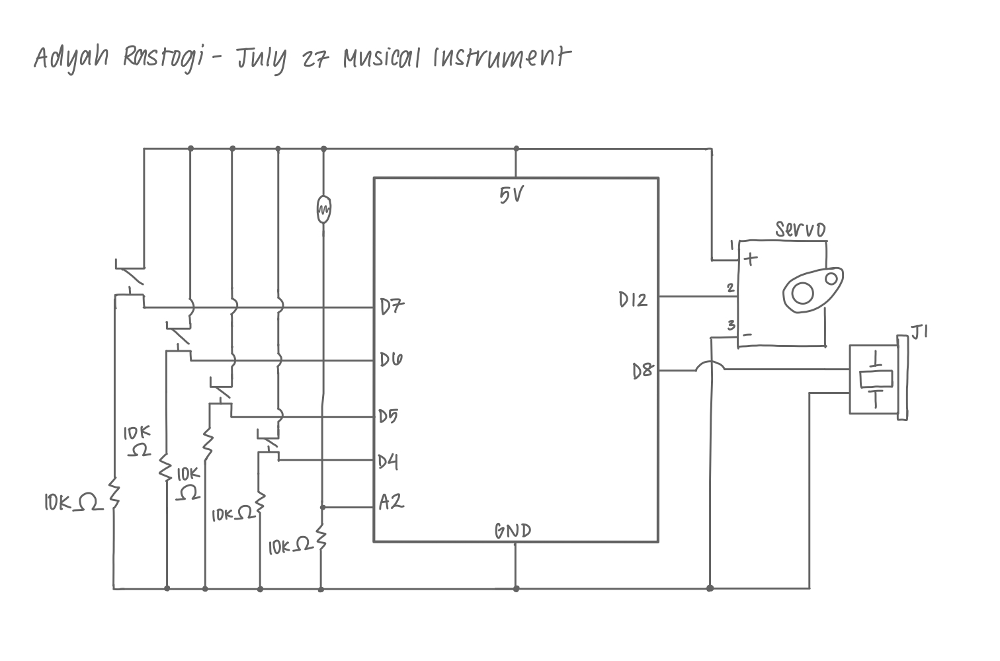

## Musical Instrument with Arduino

**Schematic**

**Instrument**

To watch the instrument in action, please watch [my video](https://github.com/adyahrastogi/creativeProgrammingAndElectronics/blob/master/27July_MusicalInstrument/instrumentJuly27.MOV)

**Close Up**

