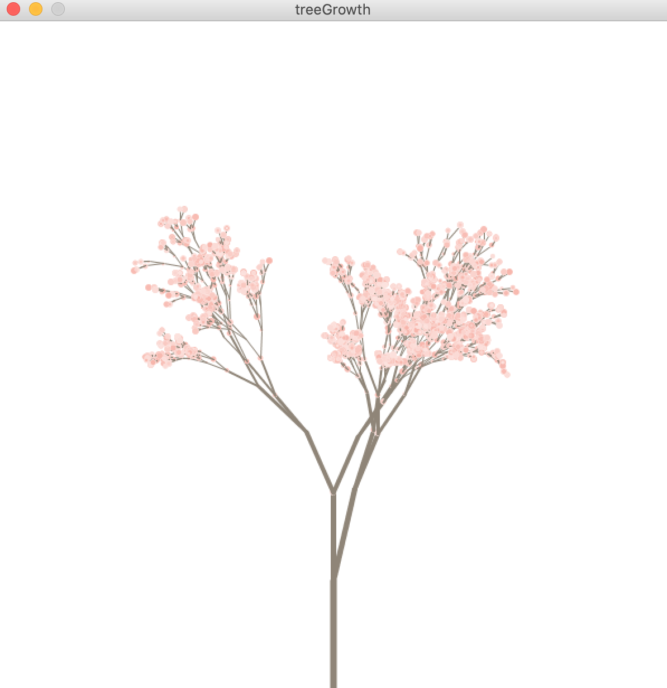
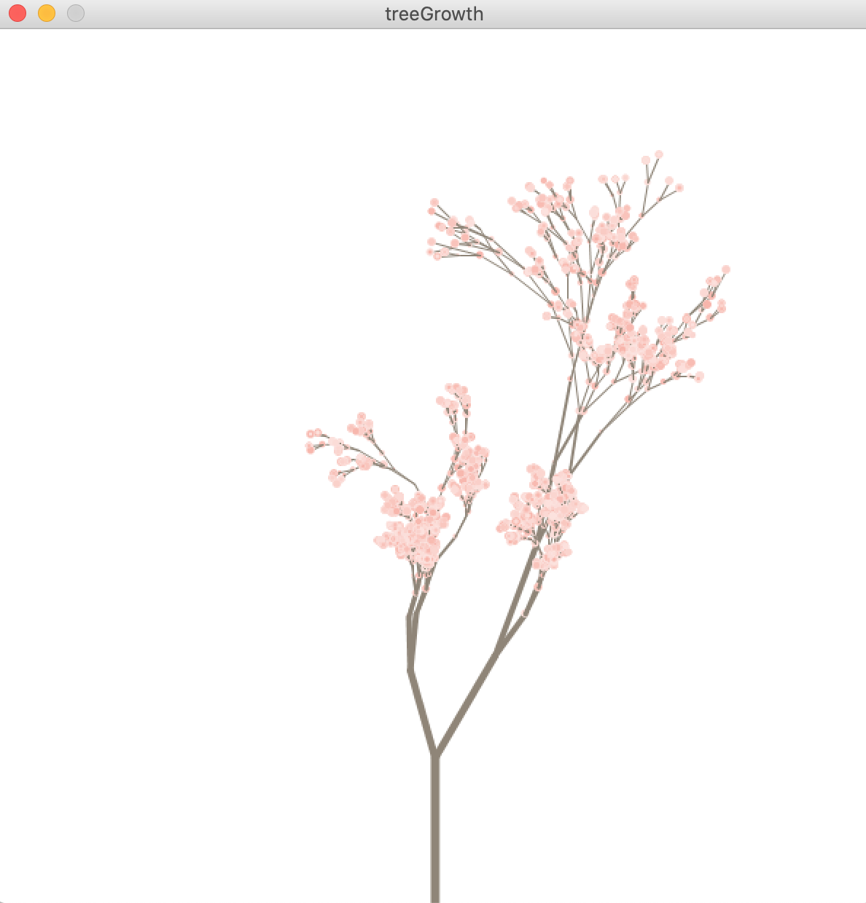

## August 10th Progress

**Current:**

So far, I have completed almost all of what I wanted my final project to be. In Processing, I made the code to draw a tree over time (draws new generation of branches every 1 second). This tree's branches shorten over time (with some randomness and variation in how much they shrink), and also grow more and more flowers as the tree grows (based on the photoresistor values, which will be explained). I implemented a photoresistor and a potentiometer, which send values to Processing using my Arduino Uno. The potentiometer controls the direction the tree grows in-- if the potentiometer starts out completely to the right at the beginning, the tree will grow leaning right in the beginning, but if switched to the left soon after, the tree will curve back and grow in the left direction. To grow the tree like trees do under normal circumstances, the potentiometer should be kept around the middle with some variation as the tree grows (the tree grows for a limited amount of time). As for the photoresistor, the photoresistor controls how many flowers are drawn. Similar to in real life, if the tree gets more light (measured by the photoresistor), the tree produces more flowers, and if it gets no light, it produces very little/none. 

**What's left:**

I would like to implement the button to make the program so that when the button is pressed, the "normal circumstances" for the tree to grow are used to grow the tree, rather than the arduino input. When the button is pressed again, the arduino input should be considered while growing the tree. Another thing I wanted to implement is making several trees. I would like to make three trees side by side, the first one with pink flowers, second with blue flowers, and third with yellow flowers. I am not sure if I should make the trees grow at the same time (with the same input from arduino so that they will grow in similar ways), one after the other, or a combination of both, where the second tree starts to grow a few seconds after the first, and same with the third tree.

Here's what the results look like currently (2 different runs):

 
