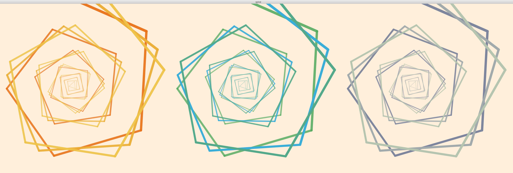

## Transformations & Loops

For this project, I was inspired by the thought of spiraling staircases and what they look like when looking downwards (perhaps in a large apartment complex). 

**Rules:**
Every next line drawn as the for loop iterates changes by the following:
- increases in size (stroke weight & length)
- increases in angle (relative to the previous line)
- increases in opacity 

In the beginning of the project, it took me a while to figure out how to translate the lines such that they both increase in size and also slightly change in angle to form a spiral shape-- I then discovered that instead of updating variables with the x and y coordinates every time a new line was drawn and also keeping track of the scaling and rotation done to those points, that it is easier to just keep calling pushMatrix() but not calling popMatrix() every time. This is so that the grid will rotate every iteration of the for loop and update the origin as it runs, rather than multiplying a variable by many different factors and keeping track of it. This, however, caused another problem! As I was experimenting with different values, I found out that Processing only allows you to use pushMatrix() 32 times (most likely because of limited amounts of space when storing such big numbers to keep track of the grid). To fix this, after the for loop to draw the spirals, I made a for loop to call popMatrix() 30 times, as I called pushMatrix() 30 times as well, in order to reset the grid to the original state. 

I was originally only going to make one spiral, but I figured adding a few more on top of it would add some depth to the image and added 2 more spirals on top of the original one with different colors and slightly different angles. I tried out a few different color combinations, but I liked all of them and couldn't decide, so I decided to keep them all, and ended up with 3 groups of spirals!
