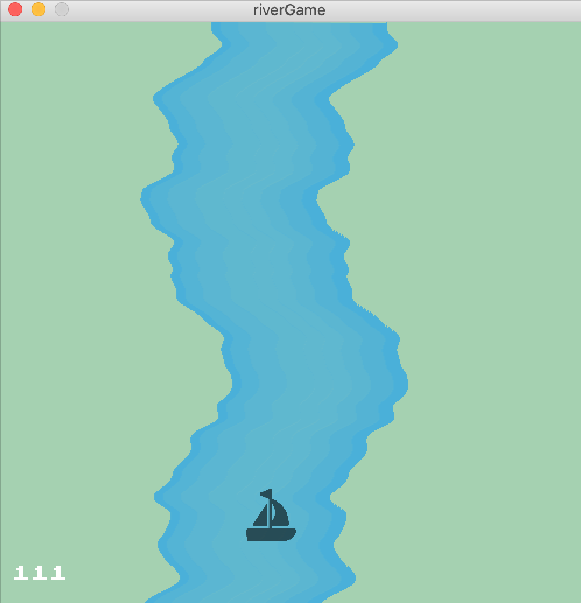
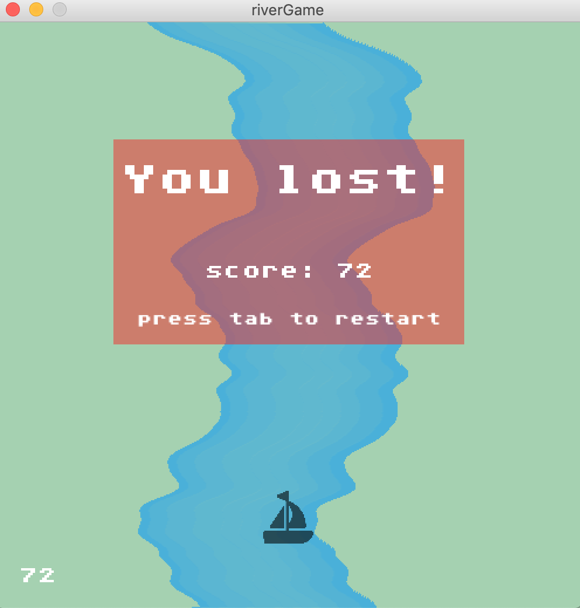

## River & Sailboat Game

For my game, I was inspired by mobile games like Color Road, Flappy Bird, and so on. These games all have some kind of space constraint, require focus, and mostly rely on hand-eye coordination. 

Credits: I used [Freepik's](https://www.flaticon.com/authors/freepik) boat image
I also used Mark Simonson's [Atari Font](https://www.fontspace.com/atari-classic-font-f30342), which is based on the Atari 8-bit character set that is seen in many older games (and some modern games).
Description: You are a sailor trying to get through a very long river! 
 The river slowly speeds up and you must make sure not to crash!
 Use the left and right arrow keys to navigate the river.
 
To create the river, I used Perlin Noise to mimic a river's natural flow. I used blue colored lines that span a set x value throughout the entire river, whose specific starting x-values I stored in an ArrayList to keep redrawing the river lower and lower as new lines were drawn at the top of the stream. I used an ArrayList because I felt that using an array would be a lot to keep track of-- by using an ArrayList, I was able to easily add and remove values to store every y pixel's starting x-value for the river. 

The game is played using the right & left arrows, and once the user crashes into the edge of the river, a reset/end screen is displayed, after which the player can press the tab key to restart the game.

Something that I had trouble with was that when I was trying to make the end/score screen allow the user to press a key to restart the game. In the keyPressed() function, I had an if-statement which was meant to reset the screen once the player has crashed and presses the tab key. This, however, wasn't working for me no matter what I tried (I tried fixing my logic for checking if the boat had crashed into the side and all sorts of other things)! I later realized, while reading the Processing documentation, that while checking for keys like tab, delete, and return/enter, you do not check if the key is coded (key == coded), unlike with other keys.
