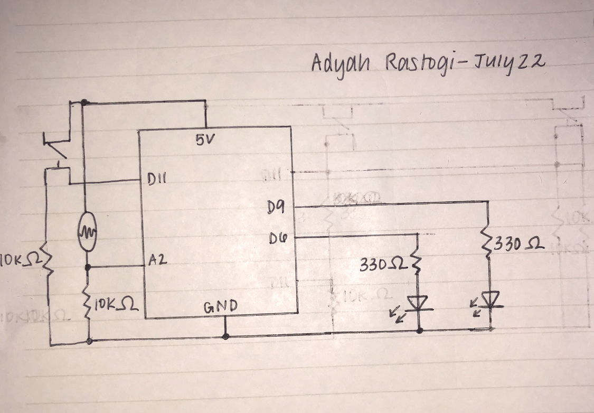

## Arduino Exploration

**Bread Board and Arduino**

**Schematic**

 

**Description**

To use the photoresistor and the switch to control two LEDs, I wired up one blue LED and one red LED. The photoresistor (analog sensor) controls the blue LED and the switch (digital sensor) controlls the red LED. 

For the photoresistor/blue LED, I made it so that the LED fades in and out (referencing the fade example we went over in class), but fades in and out faster if there is less light sensed by the photoresistor, and slower if there is more light sensed by it. For me, when I did not cover the photoresistor and didn't flash a flashlight on the photoresistor, the value was about 800, which is why I initially set the value of the sensorValue to 800, in order to make sure that the beginning would be smooth. Another thing that I took note of was that when I flashed the flashlight, the value of the sensor was around 1000. To account for this, to control the speed, I subtracted the value of the sensor from 1100 and divided it to vary the speed based on the light sensed.

For the switch/red LED, I referenced the blinkWithoutDelay tutorial that Arduino published in order to make the LED blink like 2 heartbeats, 2 blinks followed by a pause, and then another 2 blinks every time that the switch is pressed. To do this, I kept a counter to keep track of what blink was running, and varied the milliseconds between each of the blinks to simulate a heartbeat. 

**Challenges**

For this assignment, I had trouble figuring out what the best way to make the blue LED fade in and out at different speeds. At first, I tried to make it fade at a constant speed, but have a longer wait in between the fades if there was more light. However, this made it so that the LED was keeping track of the fadeAmount outside rather than inside the if-statement to tell how long the wait should be, which made the light levels jerky and inconsistent. Instead, I decided to rather than make the LED fade wait longer or less long, that I would have it fade slower or faster based on the levels of light. In the end, I was actually happier with this because it looks cooler than what it would have if it just waited longer in between! Another thing I had to use because of using two different sensors and functions was the blinkWithoutDelay tutorial, which was tough to get the hang of at first, but made sense to me after going through the example code.
