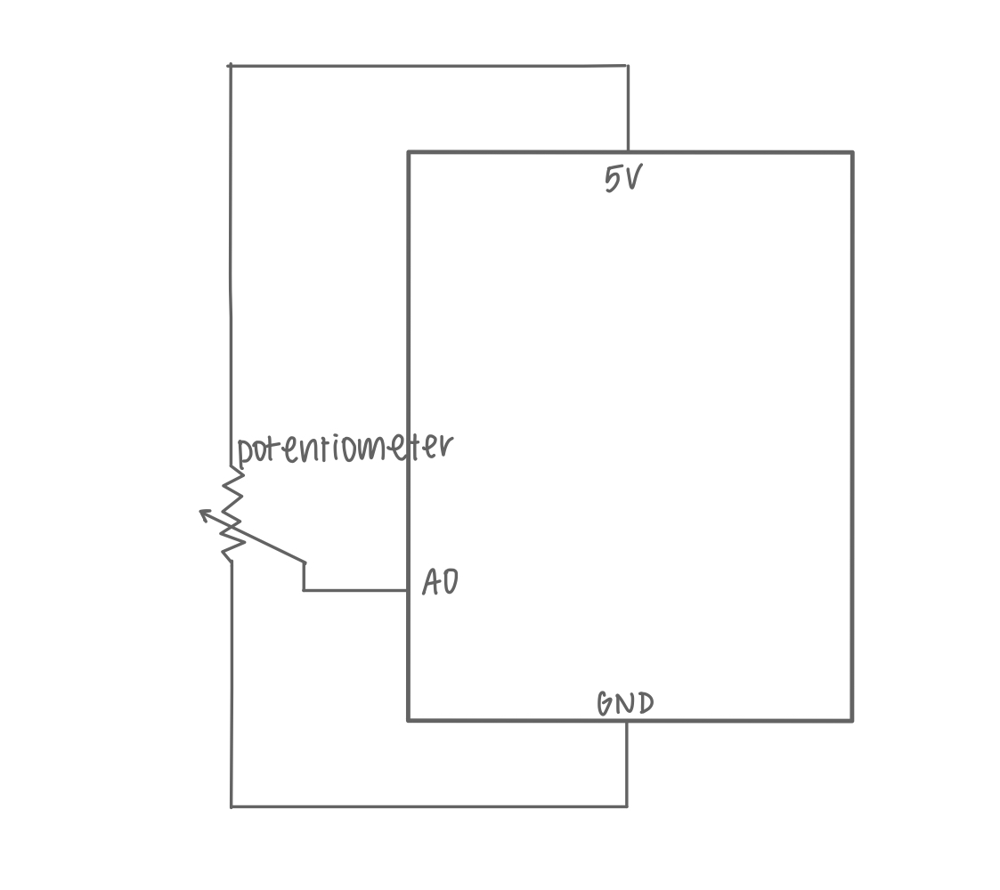
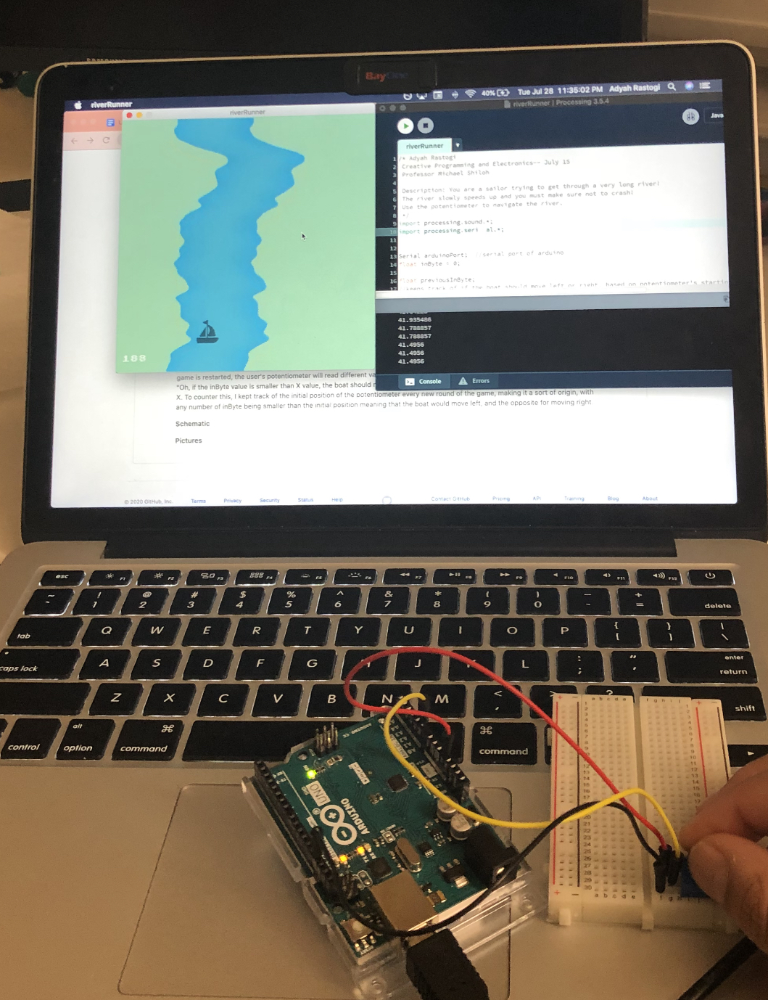
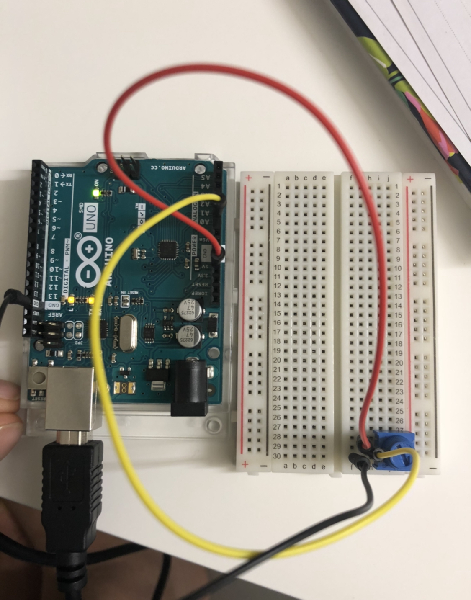

## Using Arduino input with Processing Game

**Game: River Runner**

My Processing game has the following setting: You are a sailor trying to get through a very long river! The river slowly speeds up and you must make sure not to crash!

Previously, I used the left and right keys as the method of user input to update the boat's position. To incorporate Arduino into my project, I decided to use a potentiometer. At first, I thought of using two buttons, one for moving left, and one for moving right. I soon realized that this would be way too slow for how fast the game is, and would require the user to press the buttons at terribly high speeds! Instead, I decided to use a potentiometer as this would allow the user to smoothly move the boat just by turning the potentiometer. 

I largely referenced Arduino's Graph example (Communications -> Graph) for this assignment.

**Challenges**

As I started, I tried to just update the position using the inByte values, but the boat would crash in the beginning of each game. This was an error due to the fact that the inByte value in my game doesn't actually represent the location of the boat, but the *increment* by which it moves. Another thing I had to figure out was how to keep track of when the boat should be moving left or right; every time the game is restarted, the user's potentiometer will read different values, making it impossible to use a set value as the position to tell that: "Oh, if the inByte value is smaller than X value, the boat should move left" and the same for moving right with inByte being larger than X. To counter this, I kept track of the initial position of the potentiometer every new round of the game, making it a sort of origin, with any number of inByte being smaller than the initial position meaning that the boat would move left, and the opposite for moving right. 

**Schematic**

**Pictures**

