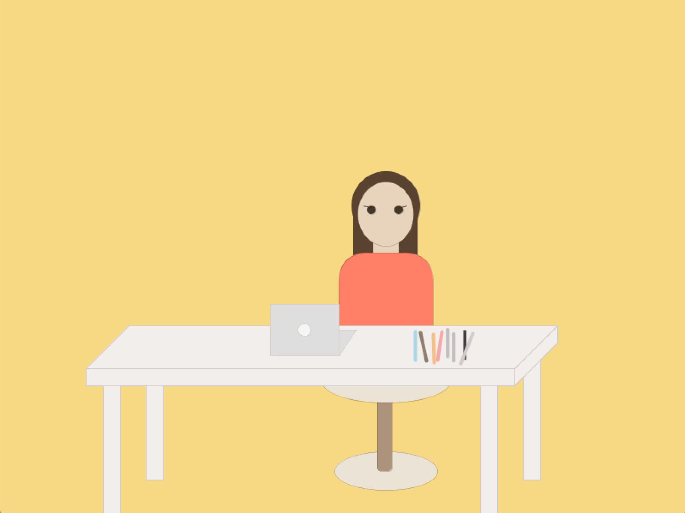

## Self Portrait
Hello, I am Adyah Rastogi. I have a lot of interests, including demography & patterns in culture and human interactions, programming, design, teaching, and many many more. However, one that I've had since *forever* is stationery, handwriting, notes, (modern) calligraphy, drawing, and just about anything to do with colors and design! For my environment, I decided to replicate my desk in my room, which is where I do most of my drawing and meticulous note-taking. The pens, markers, and pencils on my desk are a few of the many I collect.  :)

Something that was a little troublesome for me in the beginning was figuring out where the points I wanted to make were, so I sketched it out on a piece of paper first (to get a feel for what I wanted it to look like), and added lines to create a sort of coordinate grid. This helped me approximate the coordinates of shapes while I was making the image. This is what it looked like:

