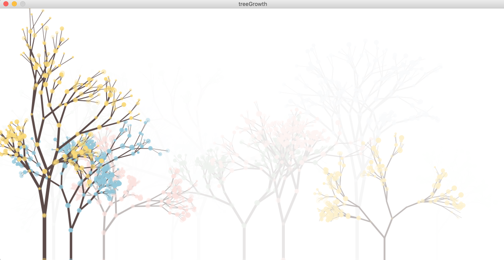
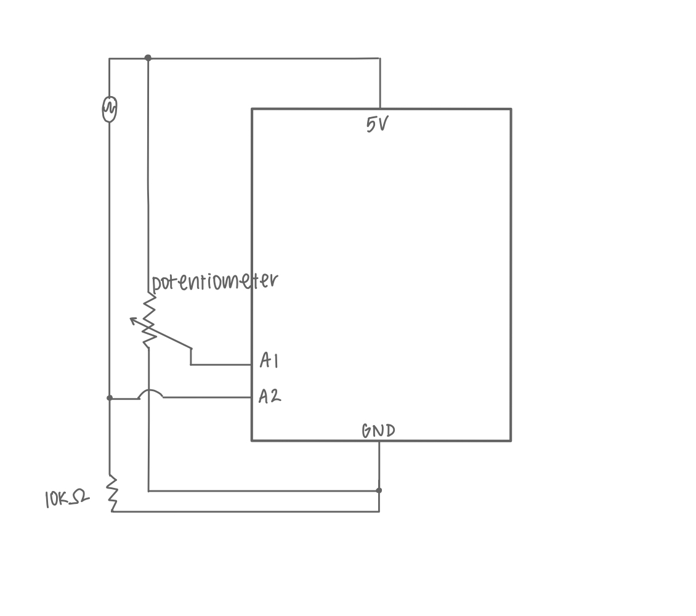
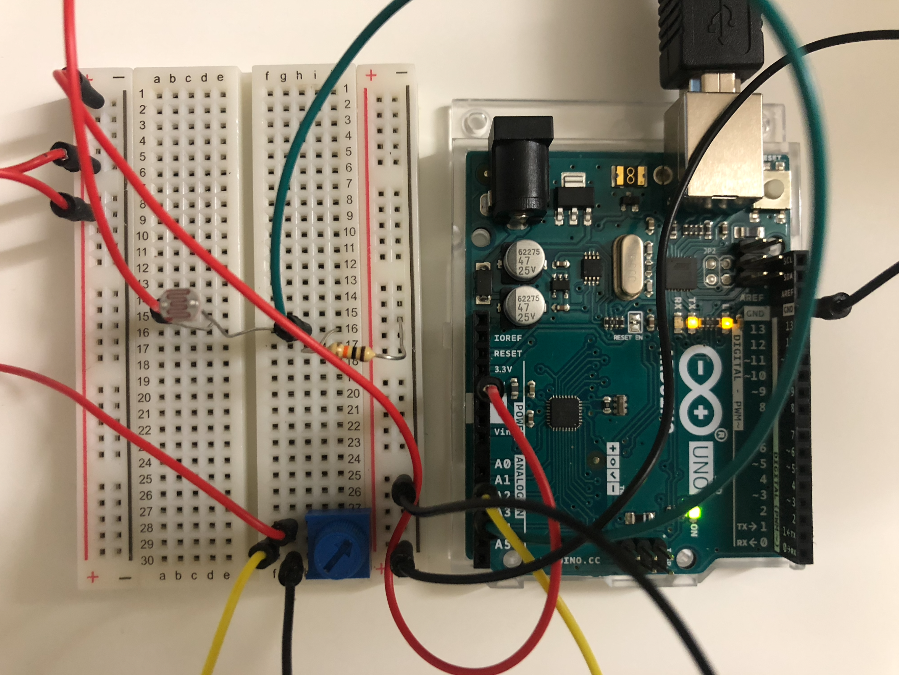

## Tree Growth-- a forever forest!

This program creates a relaxing and calming forest that keeps growing! Use a potentiometer & and a photoresistor to have some fun and change up the look of the trees, or simply watch the trees grow as time passes. Each and every one of the trees are unique and grow similar to real trees! Using a photoresistor, you can simulate different amounts of light a tree receives. You can also use a potentiometer to simulate conditions the tree grows in, such as wind, as the potentiometer influences the direction of the growth! Look out for the rare trees that have several colors of flowers :)

[Here's a video of my project!](https://youtu.be/H3ye7SDC-cU)

**Difficulties**

At first, it was very challenging figuring out the algorithm for drawing the trees and determining where the branches should grow, and how they should. In the end, I experimented with many things and ended up creating a Branch class, as well as a Tree class to store the values. The process took a lot of fine tuning, but ended up looking quite realistic! Another thing was creating the math for the logic to determine if there should be flowers drawn or not, based on the photoresistor values. Similar to drawing the tree, this also took a lot of fine tuning, but now works on every level of light (none, a little, medium, a lot)!

**Schematic and Arduino Board**

   

